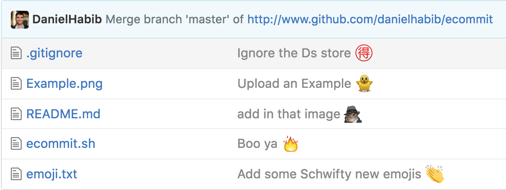

# ecommit

Ecommit appends an emoji to the end of your commit message to help classify it.

Bring your repo to life

Bring your repo to life

http://giphy.com/gifs/3o6Zt6cVCAdKITMNZ6

## Rubric

Commit Type | Emoji
----------  | -------------
Initial Commit | :tada: `:tada:`
Version Tag | :bookmark: `:bookmark:`
New Feature | :sparkles: `:sparkles:`
Bugfix | :bug: `:bug:`
Metadata | :card_index: `:card_index:`
Refactoring | :package: `:package:`
Documentation | :books: `:books:`
Internationalization | :globe_with_meridians: `:globe_with_meridians:`
Performance | :racehorse: `:racehorse:`
Cosmetic | :lipstick: `:lipstick:`
Tooling | :wrench: `:wrench:`
Tests | :rotating_light: `:rotating_light:`
Deprecation | :poop: `:poop:`
Work In Progress (WIP) | :construction: `:construction:`

## Setup
Put an alias in your bash profile

## Reasons to use this
Artistic Expression

<<<<<<< HEAD
=======

### Wanna Contribute?
shialabeouf.jpg
>>>>>>> e92d5a9321cb2ab5d5039e39c041f3a9f286b6e9
